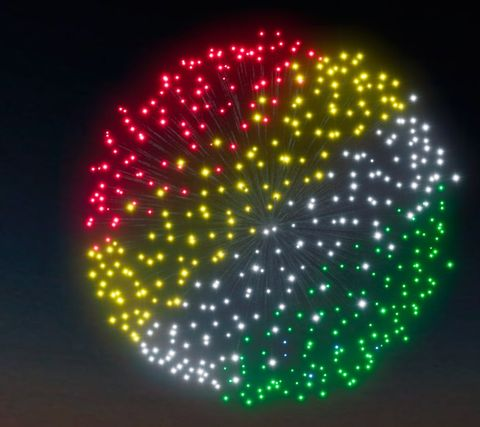
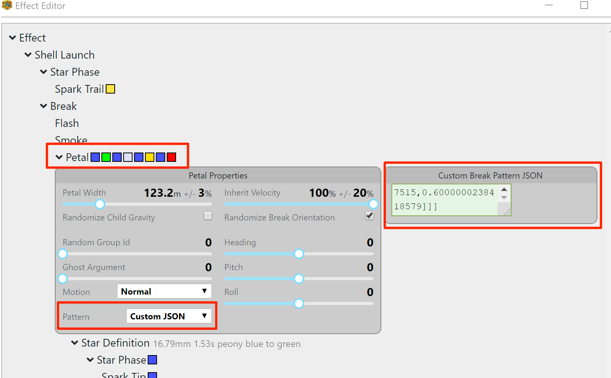

# Finale3D Custom Pattern Helper

Finale3D(F3D) has a great way of creating effects called VDL. This is the best way to create effects in F3D (super fast to create a lots of effects and enables batch changes later), but it also has an effect editor for doing effects not possible to do with VDL. This is a script to create custom patterns in the editor.

## Shapes Supported
- Azimuth Slices
- Cartesian Bands
- Six sided peony

### Azimuth Slices
Azimuth slice option splits the sphere in parts same way as slices in a orange. 4 slices creates a 1/4 Peony

### Cartesian Bands
Cartesian Bands splits the sphere evenly along one axis.

### Six Sided Peony
It splits the peony in six parts like the sides on a dice but projected on a sphere. The option to select the number of parts is not possible with this shape.

## How to use the tool:

### Run it on your computer
- Install Python3
- Use pip/pip3 to install the required packages
- Run the tool and answer the questions.
- Copy the JSON list and paste into F3D effect editor.

### Run it online
- Go to https://repl.it/
- Start a python Repl
- Copy the code from the github to the repl
- Press Run
- Answer the questions.
- Copy the JSON list and paste into F3D effect editor.

## How to import it into F3D:
Fastest way to create your effect is to create a simple effect that has the colors/stars you want. For example if you want to create a "1/4 Peony (Red, Green, Purple, Yellow)", with VDL create a "Red & Green & Purple & Yellow Peony" it is a multi color peony with the colors you want. Open the new effect in the editor. Open the "Petal", change the pattern to "custom JSON", paste the JSON list you got from the tool into the "Custom Break Pattern JSON" field.

